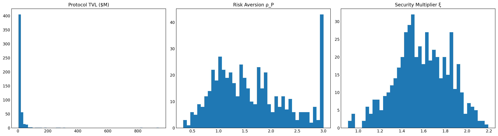

# Appendix

Online appendix to

> Hanneke, B.: *Decentralized Finance: A Market Mechanism for Cybersecurity
> Risk Insurance.* MARBLE 2026, Springer. To appear.

The proceedings version does not carry appendices (conference rule); this
folder contains them and is cited by the paper as its online appendix.
Equation numbers below refer to the proceedings version.

Provenance: Table 1 is definitional. Table 2 mirrors `SimulationParams` in
[`../defi_insurance_simulation.py`](../defi_insurance_simulation.py), which
also generates Figure A.1 (`outputs/protocol_distribution_hist.png`,
byte-identical to the paper's figure; seeded, deterministic). The proofs in
Appendix C are verified symbolically by the SymPy suite in
[`../analytical/`](../analytical/).

---

## A. Major Model Parameters

**Table 1.** Major model parameters.

| Symbol | Definition | Domain / Units |
|---|---|---|
| $C_{\mathrm{C}}$ | Protocol's posted collateral | $\mathbb{R}_{>0}$ |
| $C_{\mathrm{LP}}$ | Liquidity providers' (LP) risk capital | $\mathbb{R}_{>0}$ |
| $C_{\mathrm{S}}$ | Trading-fee inflows from insurance pricing layer | $\mathbb{R}_{\ge 0}$ |
| $C_{\mathrm{total}}$ | Total capital in insurance pool | $\mathbb{R}_{>0}$ |
| $Y_{\mathrm{total}}$ | Absolute yield generated by pool capital | $\mathbb{R}_{\ge 0}$ |
| $r_{\mathrm{pool}}$ | Return rate on insurance pool capital | $\mathbb{R}_{\ge 0}$ |
| $\mathrm{TVL}$ | Total value locked (protocol assets) | $\mathbb{R}_{\ge 0}$ |
| $\varphi$ | Operator fee from pool yield | $[0,1]$ |
| $\mu$ | Coverage amplification factor | $\mathbb{R}_{>0}$ |
| $\theta$ | Coverage concavity parameter | $(0,1)$ |
| $\xi$ | Coverage security multiplier (audits, bounties) | $\mathbb{R}_{>0}$ |
| $\alpha$ | Weight on utilization vs. risk in $\gamma$ | $[0,1]$ |
| $\beta$ | Convexity parameter for utilization in $\gamma$ | $>0$ |
| $\delta$ | Convexity parameter for risk price in $\gamma$ | $>0$ |
| $\omega_i$ | Weight of expiry $T_i$ in $P_{\mathrm{risk}}$ | $\ge 0$ |
| $\mathrm{coverage}$ | Maximum insurable amount (cap) | $\mathbb{R}_{\ge 0}$ |
| $\gamma(U,P)$ | Yield-share function | $[0,1]$ |
| $\gamma_{\min}$ | Minimum yield-share required by LPs | $[0,1]$ |
| $r_{\mathrm{LP}}$ | Realized LP return | $\mathbb{R}_{\ge 0}$ |
| $U$ | Utilization: $\mathrm{coverage}/C_{\mathrm{LP}}$ | $[0,\infty)$ |
| $U_{\max}(t)$ | Dynamic leverage ceiling (Eq. 5) | policy bounds (e.g., $[1,50]$) |
| $U_{\mathrm{target}}$ | Target utilization level | $[0,\infty)$ |
| $P_{\mathrm{HACK}}(T_i,t)$ | Market price of HACK token for expiry $T_i$ | $[0,1]$ |
| $P_{\mathrm{risk}}(t)$ | Weighted average hack probability across expiries | $[0,1]$ |
| $P_{\mathrm{anchor}}(t)$ | Annualized hack probability (anchor) | $[0,1]$ |
| $p_{\mathrm{hack}}(T)$ | Probability of hack before expiry $T$ | $[0,1]$ |
| $\widehat{p}_{1\mathrm{Y}}(t)$ | Market-implied annualized hack probability | $[0,1]$ |
| $\widehat{\lambda}(t)$ | Estimated hazard rate (Eq. 4) | $\mathbb{R}_{\ge 0}$ |
| $DF(T)$ | Discount factor for maturity $T$ | $(0,1]$ |
| $\rho_{\mathrm{P}}$ | Protocol risk-aversion coefficient | $(0,\infty)$ |
| $\rho_{\mathrm{LP}}$ | LP risk-premium coefficient | $(0,\infty)$ |
| $r_{\mathrm{market}}$ | External market return rate | $\mathbb{R}_{\ge 0}$ |
| $\pi_{\mathrm{protocol}},\ \pi_{\mathrm{LP}}$ | Profit functions of protocol and LPs | $\mathbb{R}$ |
| $\kappa_U$ | Sensitivity of prudential cap $U_{\max}(t)$ to $\widehat{p}_{1\mathrm{Y}}(t)$ (Eq. 5) | $\mathbb{R}_{\ge 0}$ |
| $\kappa_{\mathrm{LP}}$ | LP capital adjustment speed in dynamics (Prop. 2(ii)) | $\mathbb{R}_{>0}$ |

---

## B. Simulation Details

**Table 2.** Baseline simulation parameters used in Section 6
(= the defaults of `SimulationParams` in `../defi_insurance_simulation.py`).

| Parameter | Description | Value |
|---|---|---|
| $n_{\text{days}}$ | Horizon (daily steps) | $2 \times 365$ |
| $n_{\text{protocols}}$ | Number of protocols | $500$ |
| $n_{\text{mc\_runs}}$ | Monte Carlo runs | $1000$ |
| $C_{\mathrm{LP}}^{0}$ | Initial LP capital | \$250M |
| $\mu$ | Coverage scale (Eq. 2) | $3.0$ |
| $\theta$ | Coverage concavity (Eq. 2) | $0.50$ |
| $\varphi$ | Operator fee on pool yield | $0.01$ |
| $U_{\min}$ | Lower bound for utilization cap (Eq. 5) | $1.0$ |
| $U_{\max}^{\mathrm{hi}}$ | Upper bound for utilization cap (Eq. 5) | $30.0$ |
| $\kappa_U$ | Prudential cap sensitivity | $100.0$ |
| $\alpha$ | Weight on utilization in $\gamma$ | $0.6$ |
| $\beta$ | Utilization convexity in $\gamma$ | $1.0$ |
| $\delta$ | Risk-price convexity in $\gamma$ | $0.7$ |
| $U_{\text{target}}$ | Target utilization | $15.0$ |
| $r_{\text{market}}$ | External benchmark return | $5\%$ p.a. |
| $r_{\text{pool}}$ | Pool return | $10\%$ p.a. |
| $\rho_{\mathrm{LP}}$ | LP risk premium | $0.5\%$ p.a. |
| $\kappa_{\mathrm{LP}}$ | LP capital adjustment speed | $2.0$ |
| $\text{fee}^{\text{base}}_{\text{annual}}$ | Base speculator fee (annualized) | $3\%$ p.a. |
| $\text{fee}^{\text{hack}}_{\text{jump}}$ | Additional fee on hack day (annualized) | $10\%$ p.a. |
| $\omega$ | Term-structure weights $(T_1,\dots,T_4)$ | $(0.40, 0.30, 0.20, 0.10)$ |

### Protocol Population

Figure A.1 shows the distribution of TVL, risk-aversion parameters, and
security multipliers for the 500 protocols used in the simulation. The TVL
distribution is heavy-tailed with median \$8.77M and maximum \$939.86M,
closely matching empirical DeFi concentration patterns (top 10% hold 52%
of TVL).

**Figure A.1.** Distribution of protocol characteristics used in the
simulation (TVL, risk aversion, security multipliers). Generated by
`defi_insurance_simulation.py` (also in [`../outputs/`](../outputs/); the
underlying draws are in `../outputs/protocol_distribution.csv`).

### Yield-Share Simulation Implementation

The yield-share $\gamma_{\mathrm{raw}}(t)$ is given by Eq. (8) as a function
of utilization and the market-implied risk index. In the simulation, we
implement this as an adjustment around a capital-proportional "fair" split.
Let

$$
\gamma_{\mathrm{fair}}(t) = \frac{C_{\mathrm{LP},t}}{C_{\mathrm{LP},t} + \sum_i C_{\mathrm{C},i,t}}
$$

denote the share LPs would receive if yield were allocated strictly in
proportion to capital contributions in the pool (LP capital vs. posted
collateral), and let $\gamma_{\mathrm{raw}}(t)$ be the theoretical share from
Eq. (8). The applied share is then

$$
\gamma_{\mathrm{sim}}(t) = \gamma_{\mathrm{fair}}(t) + \eta \left(\gamma_{\mathrm{raw}}(t) - \gamma_{\mathrm{fair}}(t)\right), \qquad \eta = 0.5,
$$

clipped to the unit interval. When
$\gamma_{\mathrm{raw}}(t) > \gamma_{\mathrm{fair}}(t)$, LPs receive more than
their pro-rata share of capital; when
$\gamma_{\mathrm{raw}}(t) < \gamma_{\mathrm{fair}}(t)$, protocols receive
more. This implementation preserves the qualitative comparative statics of
the mechanism (higher $U$ and higher $P_{\mathrm{risk}}$ tilt the split
toward LPs) while anchoring the split in a transparent capital base and
avoiding corner cases where, in finite samples, one side temporarily
captures almost the entire pool yield.
(Code: `run_single_simulation`, step 6.)

---

## C. Proofs

All derivations below are additionally verified symbolically:
[`../analytical/verify_analytical_results.py`](../analytical/verify_analytical_results.py)
(29/29 checks pass, see
[`../analytical/verification_log.txt`](../analytical/verification_log.txt)).

### Proof of Theorem 1

Under assumption (ii), speculators are price-takers earning zero expected
profit; by Proposition 1, equilibrium HACK/NOHACK prices equal risk-neutral
hack probabilities, so speculator behavior affects the insurance game only
through the continuous price index $P_{\mathrm{risk}}(t)$ and the fee inflow
$C_{\mathrm{S}}$. It therefore suffices to establish equilibrium in the game
between the protocol and the LP; $S^{\*}$ is the implied zero-profit speculator
demand.

Strategy sets $C_{\mathrm{C}} \in [0, W_{\mathrm{C}}]$ and
$C_{\mathrm{LP}} \in [0, W_{\mathrm{LP}}]$ are nonempty, compact, and convex
due to wealth constraints. The payoffs (Eq. 9) and (Eq. 11) are continuous:
$\mathrm{coverage}(\cdot)$ is continuous by Eq. (2), $\gamma(\cdot,\cdot)$ is
bounded and continuous by Eq. (8), and expectations are taken over compact
support. By Assumption (A1), each payoff is quasi-concave in the player's own
strategy. Hence, the best-response sets

$$
B_{\mathrm{C}}(C_{\mathrm{LP}}) = \arg\max_{C_{\mathrm{C}} \in [0, W_{\mathrm{C}}]} \pi_{\mathrm{protocol}}(C_{\mathrm{C}}, C_{\mathrm{LP}}), \qquad B_{\mathrm{LP}}(C_{\mathrm{C}}) = \arg\max_{C_{\mathrm{LP}} \in [0, W_{\mathrm{LP}}]} \pi_{\mathrm{LP}}(C_{\mathrm{C}}, C_{\mathrm{LP}})
$$

are nonempty and convex. Therefore, the protocol–LP subgame satisfies the
standard sufficient conditions for Nash equilibrium existence in continuous
games on compact convex strategy sets (Nash 1951). Since the competitive
pricing layer pins HACK/NOHACK prices to risk-neutral probabilities, the
resulting fixed point extends to the full three-party mechanism. ∎

### Proof of Proposition 1

Consider a speculator with subjective belief $\tilde{p}$ about the
probability of a hack before expiry $T$. Suppose the market price of a HACK
token implies a risk-neutral probability $p_{\mathrm{market}}$.

- If $\tilde{p} > p_{\mathrm{market}}$, the speculator buys HACK tokens,
  increasing demand and pushing the price upward.
- If $\tilde{p} < p_{\mathrm{market}}$, the speculator sells or abstains,
  reducing demand and driving the price downward.

In equilibrium, with free entry and sufficient participation, marginal
traders become indifferent between buying and selling, so
$\tilde{p} = p_{\mathrm{market}}$. Hence, $p_{\mathrm{market}}$ converges to
the true risk-neutral probability of a hack event. Equilibrium HACK/NOHACK prices
therefore truthfully aggregate information and provide incentive-compatible
insurance pricing signals to the yield-share mechanism. ∎

### Proof of Proposition 2(i) (Participation Bound)

Define the LP's realized return as

$$
r_{\mathrm{LP}} = \frac{\gamma(U,P_{\mathrm{risk}})\,(1-\varphi)\,Y_{\mathrm{total}}}{C_{\mathrm{LP}}} - \frac{p_{\mathrm{hack}}\, \mathbb{E}\left[\bigl(\min(\mathrm{coverage},\mathrm{Loss})-C_{\mathrm{C}}\bigr)^{+}\right]} {C_{\mathrm{LP}}}.
$$

Substituting $Y_{\mathrm{total}} = r_{\mathrm{pool}} C_{\mathrm{total}}$,
imposing $r_{\mathrm{LP}} \ge r_{\mathrm{market}} + \rho_{\mathrm{LP}}$, and
solving for $\gamma(U,P_{\mathrm{risk}})$ yields the participation bound
(Eq. 14). ∎

### Corollary (minimum pool yield)

Rearranging the participation bound (Eq. 14) gives

$$
r_{\mathrm{pool}} \ge \frac{ C_{\mathrm{LP}} \cdot (r_{\mathrm{market}} + \rho_{\mathrm{LP}}) + p_{\mathrm{hack}}\, \mathbb{E}\bigl[\bigl(\min(\mathrm{coverage},\mathrm{Loss})-C_{\mathrm{C}}\bigr)^{+}\bigr] }{ \gamma(U,P_{\mathrm{risk}})\,(1-\varphi)\,C_{\mathrm{total}} }.
$$

Hence, the pool must outperform the market yield whenever $\gamma$ is low or
expected hack losses are high, while yield parity suffices when utilization
and $\gamma$ remain moderate.

### Corollary (capital expansion)

An increase in $C_{\mathrm{C}}$ or in trading-fee inflows $C_{\mathrm{S}}$
raises $C_{\mathrm{total}}$, thereby increasing LP leverage. Because coverage
grows sub-linearly in $C_{\mathrm{C}}$ ($\theta<1$) and does not depend on
$C_{\mathrm{S}}$, while the LP-borne loss falls as first-loss collateral
grows, the denominator of the participation bound (Eq. 14) rises
faster than its numerator. Consequently, $\gamma_{\min}$ decreases, making LP
participation attractive over a wider range of $\gamma$ values.

### Proof of Proposition 2(ii) (Self-stabilization, sketch)

Assume that $\gamma(U)$ is continuous and strictly increasing in $U$, with
$U = \mathrm{coverage}/C_{\mathrm{LP}}$. Then:

- If $U > U^{\*}$:
  $\gamma(U) > \gamma(U^{\*}) \Rightarrow
   r_{\mathrm{LP}} > r_{\mathrm{market}} + \rho_{\mathrm{LP}}$,
  so $\partial_t C_{\mathrm{LP}} > 0$ and $U \downarrow$.
- If $U < U^{\*}$:
  $r_{\mathrm{LP}} < r_{\mathrm{market}} + \rho_{\mathrm{LP}}$
  implies $\partial_t C_{\mathrm{LP}} < 0$ and $U \uparrow$.

This feedback establishes local directional stability; formal convergence
follows under standard smoothness conditions. ∎

### Proof of Proposition 3

Under assumption (i), at most one protocol $i$ suffers a material hack per
epoch, so the pool's payment obligation is
$\mathrm{Loss} = \min(\mathrm{coverage}_i,\ L_{\mathrm{true}} \cdot \mathrm{TVL}_i)$,
where $L_{\mathrm{true}}$ is the realized fractional loss. By definition of
$\psi_{1-\varepsilon}$ as the $(1-\varepsilon)$-quantile of the
loss-to-coverage ratio
$\min(1,\ L_{\mathrm{true}}\,\mathrm{TVL}_i/\mathrm{coverage}_i)$,

$$
\mathbb{P}\left(\mathrm{Loss} \le \psi_{1-\varepsilon}\,\mathrm{coverage}_i\right) \ge 1-\varepsilon.
$$

By the definition of utilization (Eq. 3) and coverage concentration,
$\mathrm{coverage}_i \le c_{\max} \sum_j \mathrm{coverage}_j = c_{\max}\, U\, C_{\mathrm{LP}}$.
Combining,

$$
\mathbb{P}\left(\mathrm{Loss} \le \psi_{1-\varepsilon}\, c_{\max}\, U\, C_{\mathrm{LP}}\right) \ge 1-\varepsilon,
$$

so the solvency condition $C_{\mathrm{LP}} \ge \mathrm{Loss}$ holds with
probability at least $1-\varepsilon$ whenever
$U \le 1/(\psi_{1-\varepsilon}\, c_{\max})$ (Eq. 17). Setting $U_{\max}(t)$
below this threshold guarantees the claim for all $U \le U_{\max}(t)$. If up
to $k$ hacks occur per epoch, the same argument applies with $c_{\max}$
replaced by the sum of the $k$ largest coverage shares. ∎
